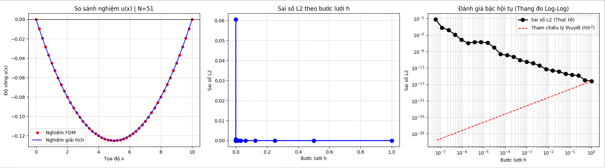
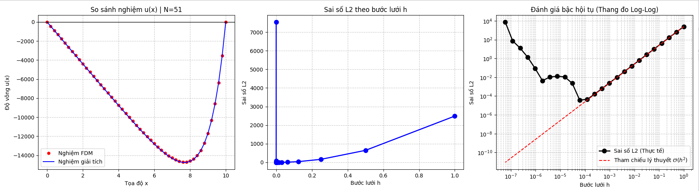

# BTL_PPT_NHOM12_HK252

> source code của BTL môn Phương pháp tính (MT1009), trường Đại học Bách Khoa - Đại học Quốc gia TP.Hồ Chí Minh

# Đề bài BTL

> Bài toán Giá trị biên (BVP)

# Mục tiêu

- Kiểm chứng độ chính xác của giải thuật Thomas (TDMA) bằng hàm g(x) là hằng số
- Đánh giá cân bằng sai số thực nghiệm bằng hàm g(x) = $e^x$
- Đánh giá bậc hội tụ thực nghiệm bằng hàm g(x) = $e^x$

# Kiểm chứng độ chính xác của giải thuật Thomas (TDMA) bằng hàm g(x) là hằng số

## Điều kiện thực nghiệm

- g(x) = 0.01
- L = 10
- N = 51

## Kết quả thực nghiệm

- u(x) = $0.005x^2 - 0.05x$
- Sai số chuẩn $L_2 = 1,9934.10^{-15}$
- Bảng giá trị so sánh với N = 51

| Tọa độ x | g(x)  | $u_{FDM}$ (Giải số) | $u_{Exact}$ (Giải tích) | Sai số tuyệt đối |
|----------|-------|-----------------|---------------------|------------------|
| 0.00     | 0.0100| 0 | 0 | 0 |
| 0.40     | 0.0100| -0,019200000000000 | -0,019200000000000 | $1,0408.10^{-16}$ |
| 0.80     | 0.0100| -0,036800000000000 | -0,036800000000000 | $1,0408.10^{-16}$ |
| 1.20     | 0.0100| -0,052800000000000 | -0,052800000000000 | $1,0408.10^{-16}$ |
| 1.60     | 0.0100| -0,067200000000000 | -0,067200000000000 | $1,0408.10^{-16}$ |
| 2.00     | 0.0100| -0,080000000000000 | -0,080000000000000 | $1,0408.10^{-16}$ |
| 2.40     | 0.0100| -0,091199999999999 | -0,091200000000000 | $1,0408.10^{-16}$ |
| 2.80     | 0.0100| -0,100799999999999 | -0,100800000000000 | $1,0408.10^{-16}$ |
| 3.20     | 0.0100| -0,108799999999999 | -0,108800000000000 | $1,0408.10^{-16}$ |
| 3.60     | 0.0100| -0,115199999999999 | -0,115200000000000 | $1,0408.10^{-16}$ |
| 4.00     | 0.0100| -0,119999999999999 | -0,120000000000000 | $1,0408.10^{-16}$ |
| 4.40     | 0.0100| -0,123199999999999 | -0,123200000000000 | $1,0408.10^{-16}$ |
| 4.80     | 0.0100| -0,124799999999999 | -0,124800000000000 | $1,0408.10^{-16}$ |
| 5.20     | 0.0100| -0,124799999999999 | -0,124800000000000 | $1,0408.10^{-16}$ |
| 5.60     | 0.0100| -0,123199999999999 | -0,123200000000000 | $1,0408.10^{-16}$ |
| 6.00     | 0.0100| -0,119999999999999 | -0,120000000000000 | $1,0408.10^{-16}$ |
| 6.40     | 0.0100| -0,115199999999999 | -0,115200000000000 | $1,0408.10^{-16}$ |
| 6.80     | 0.0100| -0,108799999999999 | -0,108800000000000 | $1,0408.10^{-16}$ |
| 7.20     | 0.0100| -0,100799999999999 | -0,100800000000000 | $1,0408.10^{-16}$ |
| 7.60     | 0.0100| -0,091199999999999 | -0,091200000000000 | $1,0408.10^{-16}$ |
| 8.00     | 0.0100| -0,079999999999999 | -0,080000000000000 | $1,0408.10^{-16}$ |
| 8.40     | 0.0100| -0,067200000000000 | -0,067200000000000 | $1,0408.10^{-16}$ |
| 8.80     | 0.0100| -0,052800000000000 | -0,052800000000000 | $1,0408.10^{-16}$ |
| 9.20     | 0.0100| -0,036800000000000 | -0,036800000000000 | $1,0408.10^{-16}$ |
| 9.60     | 0.0100| -0,019200000000000 | -0,019200000000000 | $1,0408.10^{-16}$ |
| 10.00    | 0.0100| 0 | 0 | 0 |

- Đánh giá cân bằng sai số và bậc hội tụ (N = $10*2^n+1$, n = 1 -> 25)

# Đánh giá cân bằng sai số thực nghiệm bằng hàm g(x) = $e^x$

## Điều kiện thực nghiệm

- g(x) = $e^x$
- L = 10
- N = 51

## Kết quả thực nghiệm

- u(x) = $-2202,54657948067*x + e^x - 1$
- Sai số chuẩn $L_2 = 1,0449.10^{2}$
- Bảng giá trị so sánh với N = 51

| Tọa độ x | g(x) | u_FDM (Giải số) | u_Exact (Giải tích) | Sai số tuyệt đối |
|-----------|-------|-----------------|---------------------|------------------|
| 0,00 | 0,0000 | 0 | 0 | 0 |
| 0,40 | 0,4918 | -870,597578611635299 | -880,526807094626747 | $0,9292$|
| 0,80 | 0,2255 | -1750,954107835117348 | -1760,811722656043685 | $0,9292$|
| 0,20 | 0,3201 | -2630,959002859156533 | -2640,743577845106168 | $0,9292$|
| 0,60 | 0,9530 | -3500,411186707583056 | -3520,124194744676966 | $0,9292.10^{1}$|
| 0,00 | 0,3891 | -4380,071304647983680 | -4390,704102862409854 | $0,9292.10^{1}$|
| 0,40 | 10,0232 | -5250,536770495540679 | -5270,088614372976741 | $0,9292.10^{1}$|
| 0,80 | 10,4446 | -6130,221102754446482 | -6150,685757774780268 | $0,9292.10^{1}$|
| 0,20 | 20,5323 | -7000,247892273367134 | -7020,616524141034133 | $0,9292.10^{1}$|
| 0,60 | 30,5982 | -7860,310093897678598 | -7890,569415687343283 | $0,9292.10^{1}$|
| 0,00 | 50,5982 | -8720,175823584486556 | -8750,588167889536635 | $0,9292.10^{1}$|
| 0,40 | 80,4509 | -9570,782204248048563 | -9610,754081049981323 | $0,9292.10^{1}$|
| 0,80 | 120,5104 | -10410,943687750701524 | -10450,713163988482847 | $0,9292.10^{1}$|
| 0,20 | 180,2722 | -11230,468438620935283 | -11270,969977412343192 | $0,9292.10^{1}$|
| 0,60 | 270,4264 | -12020,698626711965571 | -12060,834143766563203 | $0,9292.10^{1}$|
| 0,00 | 400,4288 | -12770,226461712658021 | -12810,681072683087021 | $0,9292.10^{1}$|
| 0,40 | 600,8450 | -13450,558054312583440 | -13490,453078804257099 | $0,9292.10^{1}$|
| 0,80 | 890,8473 | -14030,628271653943476 | -14080,469448813194126 | $0,9292.10^{1}$|
| 0,20 | 1330,4308 | -14470,681571769237151 | -14510,601968078664607 | $0,9292.10^{1}$|
| 0,60 | 1990,1959 | -14690,115701769237677 | -14740,158180489973677 | $0,9292.10^{1}$|
| 0,00 | 2980,9580 | -14590,710714696983635 | -14640,014480983083635 | $0,9292.10^{1}$|
| 0,40 | 4440,0667 | -14000,566991842473523 | -14050,324159937770674 | $0,9292.10^{1}$|
| 0,80 | 6630,2440 | -12700,755332243723269 | -12740,165893152802371 | $0,9292.10^{1}$|
| 0,20 | 9890,1291 | -10330,810813346327421 | -10360,299472478238386 | $0,9292.10^{1}$|
| 0,60 | 14760,7816 | -6350,439192845716480 | -6380,665597437142424 | $0,9292.10^{1}$|
| 10,00 | 22020,4658 | 0 | 0,00000000000001890 | $0,9292.10^{-02}$|

- Đánh giá cân bằng sai số và bậc hội tụ (N = $10*2^n+1$, n = 1 -> 25)

